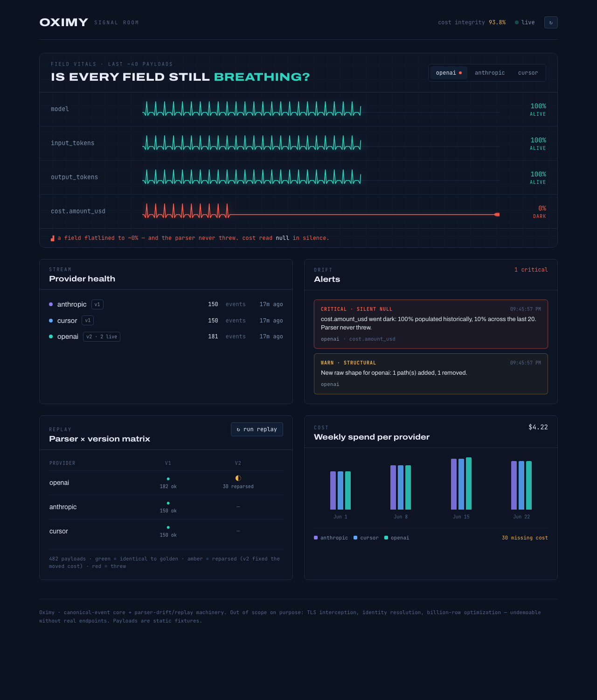

# Oximy — Mini AI Observability MVP

I built the **canonical-event core** and the **parser-drift / replay machinery**; I scoped out
TLS interception, identity resolution, and billion-row optimization as undemoable without real
endpoints. Payloads are static JSON fixtures, on purpose.

The whole project exists to prove one thing well:

> **Provider payloads change silently, and this system catches it before the numbers lie.**

A provider moves `cost` one level deeper. The parser doesn't crash — it just reads `null`. Your
weekly spend quietly drops and nobody notices. Oximy catches exactly that, as a behavioral signal,
not a stack trace.



The hero is a heart monitor for your data: every expected field beats while it's populated, and
`cost.amount_usd` visibly **flatlines** the moment it goes dark — while the parser kept "succeeding".

---

## Quickstart

Requires Node 20+ and Docker (only Postgres runs in Docker; the app runs on your machine).

```bash
# 1. Postgres (the only infra)
docker compose up -d db

# 2. API + core
npm install
npm run migrate      # apply schema
npm run seed         # run the full 5-step demo against a clean DB (this is the acceptance test)
npm run dev          # Fastify API on http://localhost:3001

# 3. Dashboard (separate terminal)
cd web
npm install
npm run dev          # Next.js on http://localhost:3000
```

Then open **http://localhost:3000**.

```bash
npm test             # Vitest, including the replay regression gate
```

---

## The demo (`npm run seed` reproduces this, with assertions)

```
[1] Seed ~150 clean payloads each for openai / anthropic / cursor
        ✓ 450 events ingested, all parsed
        ✓ replay matrix all green
[2] Re-send 30 openai payloads → 0 new rows                 (dedup works)
[3] cost=null arrives, a follow-up backfills the same dedup_key
        ✓ revision 1 → 2, cost corrected, NO duplicate
[4] openai ships 'bad' payloads: cost moved to pricing.cost (v1 reads null)
        ✓ drift fired: SILENT_NULL cost.amount_usd CRITICAL + STRUCTURAL warn
[5] Register openai parser v2 and re-run replay
        ✓ all historical payloads still parse (zero throws)
        ✓ anthropic + cursor matrix cells unchanged — no regression
        ✓ openai v2 reparses the bad payloads (152 ok, 30 corrected)
```

**Steps 2–4 are the differentiators.** Step 2 proves idempotent redelivery. Step 3 proves cost can
arrive late and revise a row in place. Step 4 is the headline: a field moved, the parser didn't
throw, cost silently read `null` — and a `CRITICAL` alert fired anyway.

---

## How it works

```
/src
  /core            the showcase — pure, no DB/HTTP imports, fully unit-tested
    canonical.ts   CanonicalEvent zod schema (the one shape every reader reads)
    dedup.ts       deterministic dedup key + content hash + stable uuid
    assemble.ts    shared parser → canonical assembly + validation
    parser.ts      Parser interface
    parsers/       openai (v1, v2), anthropic (v1), cursor (v1)
    registry.ts    version registry
    fingerprint.ts structural fingerprint (path-based)
    drift.ts       two-mode drift detector
    replay.ts      replay harness + golden diff
  /db              pool, migrations.sql, ingest pipeline, queries
  /api             Fastify routes
  /seed            fixtures + the demo/acceptance script
/web               Next.js + Tailwind dashboard (read-only)
docker-compose.yml just Postgres
```

`/core` imports nothing from `/db` or `/api`. That separation is the point — the engine is
trivially testable in isolation.

### The five contracts

1. **CanonicalEvent** — one shape. Identity fields are stable; `cost`/`tokens` are facts that arrive
   late and stay revisable.
2. **Deterministic dedup key** — derived only from identity (provider event id, else
   provider+time+model+user+content hash). **Never** from cost/tokens, so a backfill revises the
   existing row instead of minting a duplicate.
3. **Versioned parsers** — `parse(raw) → CanonicalEvent`, pure. Each declares the canonical fields it
   `expects` to populate. openai v2 exists because cost moved to `pricing.cost`; it stays backward
   compatible, which is why replay shows no regression.
4. **Drift detection, two modes:**
   - *Structural* — a fingerprint of the raw payload's key paths. A never-before-seen shape emits a
     `warn` listing added/removed/moved paths. It keys on **paths, not value types**, so a nullable
     field going null is not mistaken for a shape change — only a genuinely moved path is.
   - *Silent-null* (**the differentiator**) — a field populated >90% historically that suddenly
     drops to near-0% over the recent window, *without the parser throwing*. Severity is `critical`
     when the field is `cost.amount_usd`. The baseline window excludes the recent window, so a fresh
     wave of nulls can't dilute the signal it's meant to trip.
5. **Replay harness** — every raw payload is stored with the golden canonical captured at ingest.
   On demand, re-run all parser versions across the full corpus and diff each result: `ok` (matches
   golden) / `drift` (parses but differs — e.g. v2 correcting the moved cost) / `throw`. Exposed as
   a provider × version matrix. The Vitest gate asserts (a) every historical payload still parses and
   (b) changing one provider's parser causes zero new failures for the others.

### Ingest upsert (Contract 2 in SQL)

`INSERT … ON CONFLICT (dedup_key) DO UPDATE` fills null cost/tokens (or takes a more authoritative
value), updates the raw-payload pointer, and bumps `revision` **only when a value actually changed** —
so a redelivery is a true no-op while a real backfill goes `revision 1 → 2`. Identity fields are
never touched.

---

## Dashboard (read-only)

Four panels plus the hero, fed by the Fastify API:

- **Field Vitals** (hero) — per-field population traces; the flatline is the silent-null moment.
- **Provider health** — live parser version, event count, last payload time.
- **Drift alerts** — red for the critical silent-null on cost.
- **Replay matrix** — provider × version, with a "run replay" button.
- **Weekly cost** — spend per provider plus the `missing_cost` count (an honest undercount, shown not hidden).

The dashboard tells you **that** something is wrong; two engineering tools explain **why** and **how**.

### Event Inspection (`/inspect`)

Click any drift alert or provider row to open a forensic reconstruction of a single event's full
lifecycle. One endpoint — `GET /inspect?alertId= | provider= | eventId=` — resolves the target
event and reuses the core (`fingerprint`, `replay`, `registry`) to return eight sections: the raw
provider payload (syntax-highlighted, copyable), the selected parser's expected-vs-received fields,
the canonical event (nulls emphasized), a **structural diff** (`cost.amount_usd` → `pricing.cost.amount_usd`),
**silent-null analysis** (historical vs recent population, threshold, a flatline sparkline), replay
results, an **event-journey timeline** (✓ / ⚠ / ✗ per stage), and engineering notes (root cause,
impact, suggested fix, replay). It answers: what happened, why, where, which parser, how it's fixed,
and whether historical data is still valid — no business logic is duplicated client-side.

### Architecture (`/architecture`)

A visual explanation of the system using responsive HTML/CSS diagrams (no static images, dark-mode
native): high-level architecture, the ingestion pipeline (animated), the replay harness with a
pass/drift/regression legend, why silent-null is dangerous (echoing the heartbeat hero), and the
canonical transformation (three provider schemas → one shape).

---

## Explicitly out of scope (deliberately)

TLS interception, browser extensions, identity resolution, auth, multi-tenancy, queues, Redis,
billion-row optimization, and real provider API calls. These are undemoable without real endpoints,
so scoping them out keeps the focus on the core engine. Payloads are static fixtures.

## Tech

TypeScript everywhere · Fastify · PostgreSQL via `pg` (raw SQL, no ORM) · Zod · Vitest ·
Next.js + Tailwind. No queue, no auth, no Docker for the app itself.
